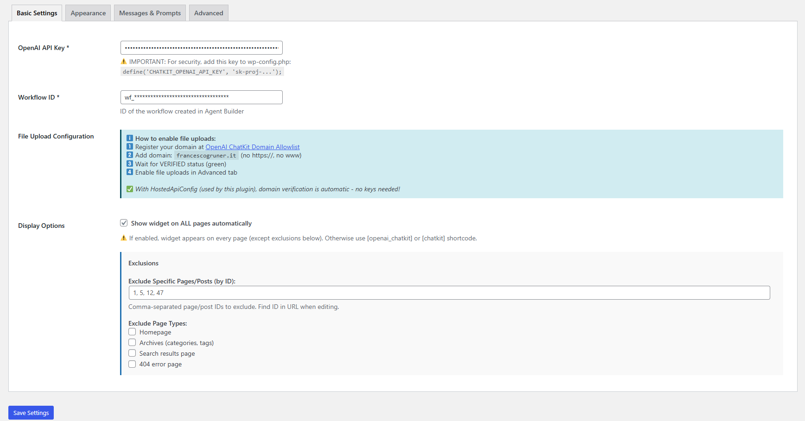
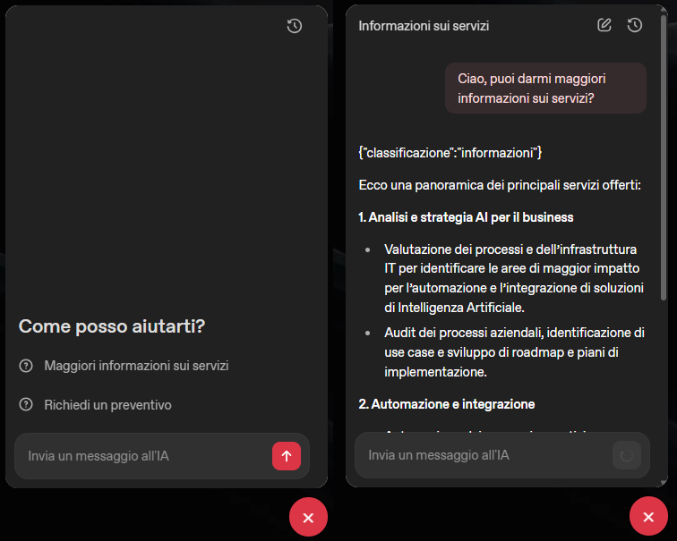

# OpenAI ChatKit for WordPress

**Contributors:** francescogruner  
**Tags:** openai, chatkit, chatbot, ai, assistant, widget  
**Requires at least:** 5.8  
**Tested up to:** 6.5  
**Requires PHP:** 7.4  
**Stable tag:** 1.1.0  
**License:** GPL-2.0-or-later  
**License URI:** https://www.gnu.org/licenses/gpl-2.0.html

Integrate OpenAI's ChatKit into your WordPress site with guided setup. Supports customizable text in any language.

## Description

This plugin seamlessly integrates OpenAI's ChatKit into your WordPress website. It provides an easy-to-use interface to connect your OpenAI Agent Builder workflow and embed a powerful AI chatbot directly into your site.

## Screenshots

Here are some screenshots to give you a quick overview of the plugin's interface.

### Admin Settings Page

### Live Chat Widget on Frontend

### Features:

*   **Easy Setup:** Guided configuration via the WordPress admin panel.
*   **Customizable Text:** Personalize the greeting message and default quick questions directly from the settings page.
*   **Multi-language Ready:** Supports customizable text in any language (e.g., English, Italian) via settings. Translatable admin interface strings included (e.g., Italian `.po`/`.mo` files provided).
*   **Flexible Display:** Add the chatbot to specific pages using the `[openai_chatkit]` shortcode or display it globally on all pages.
*   **Customizable Styling:** Adjust the accent color and theme (dark/light) to match your site's design.
*   **Advanced Options:** Enable file attachments and persistent conversation history (via cookies).

## Attribution / Credits

This plugin is based on the original work by [Francesco Grüner](https://francescogruner.it). If you modify or build upon this code, please retain the original author's name and license.

## Installation

1.  Download the plugin files from this repository.
2.  Navigate to **Plugins > Add New** in your WordPress admin panel.
3.  Click **"Upload Plugin"**.
4.  Select the `.zip` file containing the plugin folder (e.g., `chatkit-wp.zip`) and click **"Install Now"**.
5.  Activate the plugin.
6.  Go to **Settings > ChatKit** to configure your OpenAI API Key and Workflow ID.

## Configuration

1.  **Create an OpenAI Workflow:** Go to [OpenAI Agent Builder](https://platform.openai.com/agent-builder) (requires login) and create your AI agent workflow.
2.  **Get Credentials:**
    *   Copy the **Workflow ID** (starts with `wf_`).
    *   Generate an **API Key** from [OpenAI Dashboard](https://platform.openai.com/api-keys) (requires login).
3.  **Configure the Plugin:** In your WordPress admin, go to **Settings > ChatKit** and enter your API Key and Workflow ID.
4.  **Customize Texts:** In the same settings page, you can set the greeting text and up to 3 default quick questions.
5.  **Add to Site:** Use the `[openai_chatkit]` shortcode on specific pages/posts, or check the "Show widget on ALL pages automatically" option for a global chatbot.

## Frequently Asked Questions

### Where do I get the OpenAI API Key and Workflow ID?

You need to create an account on the [OpenAI Platform](https://platform.openai.com/). The API Key is generated in the [API Keys section](https://platform.openai.com/api-keys), and the Workflow ID comes from a workflow you create in [Agent Builder](https://platform.openai.com/agent-builder).

### Can I change the chatbot's appearance?

Yes, you can customize the accent color and theme (dark/light) in the plugin's settings page.

### Is the plugin translatable?

Yes, the admin interface strings are prepared for translation. An Italian translation file is included. You can add other languages by creating `.po`/`.mo` files in the `languages` folder.

## Changelog

### 1.1.0
*   Added support for customizable greeting and default quick questions (up to 3).
*   Improved admin settings interface.
*   Added Italian translation files for admin interface.

### 1.0.0
*   Initial release.
